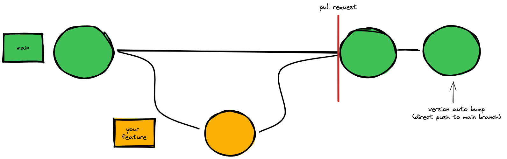
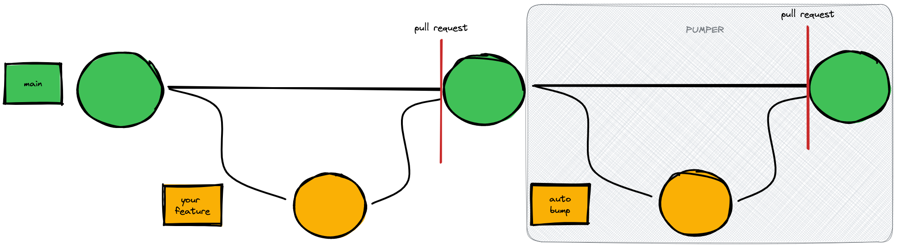

<!-- markdownlint-disable-file no-inline-html first-line-h1 -->
<div align="center">

# pumper

[](https://pypi.org/project/pumper) [](https://pypi.org/project/pumper) [](https://github.com/psf/black) [](https://github.com/python/mypy) [](https://github.com/pycqa/isort)

Automagically 🧚‍♀️ create branch, pull request, bump version (using [`Commitizen`](https://commitizen-tools.github.io/commitizen/)), approve and merge.

</div>

---

`pumper` helps create CI/CD `bump version` jobs more secure 👮‍♀️.

**Common version bump strategy** these days is to have CI/CD workflow run automatic version bump directly in a main branch:



This raises following concerns (among others) in highly secured environments:

- direct push to a main branch required
- branch protection rules needs to be relieved
- change in main branch is not reviewed

Bump strategy with `pumper`:



1. Call **great** tool [`Commitizen`](https://commitizen-tools.github.io/commitizen/). It checks your commit history and bumps your version. Check it out for more information how to configure and use it.
2. Create a branch including changes from above step a push it.
3. Create PR.
4. Optionally approve a merge PR.

## Quick install guide

`pumper` can be installed from [PYPI](https://pypi.org/project/pumper). It's recommended to install it in isolated Python environment using [venv](https://docs.python.org/3/tutorial/venv.html).

```bash
python -m venv .venv
.venv/bin/pip install pumper
```

## How to use it

### Using CLI

#### `pump create`

```bash
 Usage: pumper create [OPTIONS]

 Bump version, push branch and create pull request.

╭─ Options ──────────────────────────────────────────────────────────────────────╮
│ *  --repo            TEXT  The owner and repository name, eg 'owner/repo'.     │
│                            [env var: GITHUB_REPOSITORY]                        │
│                            [default: None]                                     │
│                            [required]                                          │
│    --url             TEXT  Github API url.                                     │
│                            [env var: GITHUB_API_URL]                           │
│                            [default: https://api.github.com]                   │
│ *  --token           TEXT  Github token.   [env var: GITHUB_TOKEN]             │
│                            [default: None] [required]                          │
│    --base            TEXT  Base branch of a PR. [env var: BASE_BRANCH]         │
│                            [default: main]                                     │
│    --branch          TEXT  Branch name and PR title.                           │
│                            [default: release/{version}]                        │
│    --user            TEXT  Git user name. [default: github-actions[bot]]       │
│    --email           TEXT  Git user email.                                     │
│                            [default:                                           │
│                            github-actions[bot]@users.noreply.github.com]       │
│    --gh-env                Create 'PR_NUM' env var for GH actions              │
│    --label           TEXT  Add labels to PR. [default: None]                   │
│    --assign                Assign PR [default: True]                           │
│    --assignee        TEXT  PR assignee name. [env var: GITHUB_ACTOR]           │
│    --help                  Show this message and exit.                         │
╰────────────────────────────────────────────────────────────────────────────────╯
```

#### `pumper approve`

```bash
 Usage: pumper approve [OPTIONS] PR_NUM

 Approve pull request.

╭─ Arguments ────────────────────────────────────────────────────────────────────╮
│ *    pr_num      INTEGER  PR number. [env var: PR_NUM] [default: None]         │
│                           [required]                                           │
╰────────────────────────────────────────────────────────────────────────────────╯
╭─ Options ──────────────────────────────────────────────────────────────────────╮
│ *  --repo         TEXT  The owner and repository name, eg 'owner/repo'.        │
│                         [env var: GITHUB_REPOSITORY]                           │
│                         [default: None]                                        │
│                         [required]                                             │
│    --url          TEXT  Github API url.                                        │
│                         [env var: GITHUB_API_URL]                              │
│                         [default: https://api.github.com]                      │
│ *  --token        TEXT  Github token. [env var: GITHUB_TOKEN] [default: None]  │
│                         [required]                                             │
│    --body         TEXT  PR message. [default: 🤖 Approved by GH actions!]      │
│    --help               Show this message and exit.                            │
╰────────────────────────────────────────────────────────────────────────────────╯
```

#### `pumper merge`

```bash
 Usage: pumper merge [OPTIONS] PR_NUM

 Merge pull request.

╭─ Arguments ────────────────────────────────────────────────────────────────────╮
│ *    pr_num      INTEGER  PR number. [env var: PR_NUM] [default: None]         │
│                           [required]                                           │
╰────────────────────────────────────────────────────────────────────────────────╯
╭─ Options ──────────────────────────────────────────────────────────────────────╮
│ *  --repo         TEXT  The owner and repository name, eg 'owner/repo'.        │
│                         [env var: GITHUB_REPOSITORY]                           │
│                         [default: None]                                        │
│                         [required]                                             │
│    --url          TEXT  Github API url.                                        │
│                         [env var: GITHUB_API_URL]                              │
│                         [default: https://api.github.com]                      │
│ *  --token        TEXT  Github token. [env var: GITHUB_TOKEN] [default: None]  │
│                         [required]                                             │
│    --help               Show this message and exit.                            │
╰────────────────────────────────────────────────────────────────────────────────╯
```

### Github actions

See my GH actions [`bumper.yaml` workflow](.github/workflows/bumper.yaml).

#### Required setup

- [allow GitHub Actions to create and approve pull requests](https://docs.github.com/en/repositories/managing-your-repositorys-settings-and-features/enabling-features-for-your-repository/managing-github-actions-settings-for-a-repository#preventing-github-actions-from-creating-or-approving-pull-requests) in your repository settings
- add following [permissions to `GITHUB_TOKEN`](https://docs.github.com/en/actions/security-guides/automatic-token-authentication#modifying-the-permissions-for-the-github_token):

    ```yaml
    permissions:
        pull-requests: write
        contents: write
    ```

## Appreciation

Big thanks 🙏 to following libraries:

- [`Commitizen`](https://commitizen-tools.github.io/commitizen/)
- [`PyGithub`](https://github.com/PyGithub/PyGithub)
- [`Rich`](https://github.com/Textualize/rich)
- [`Typer`](https://typer.tiangolo.com)
